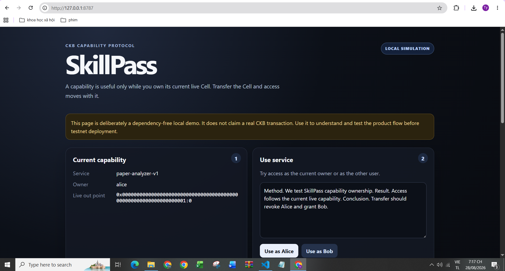
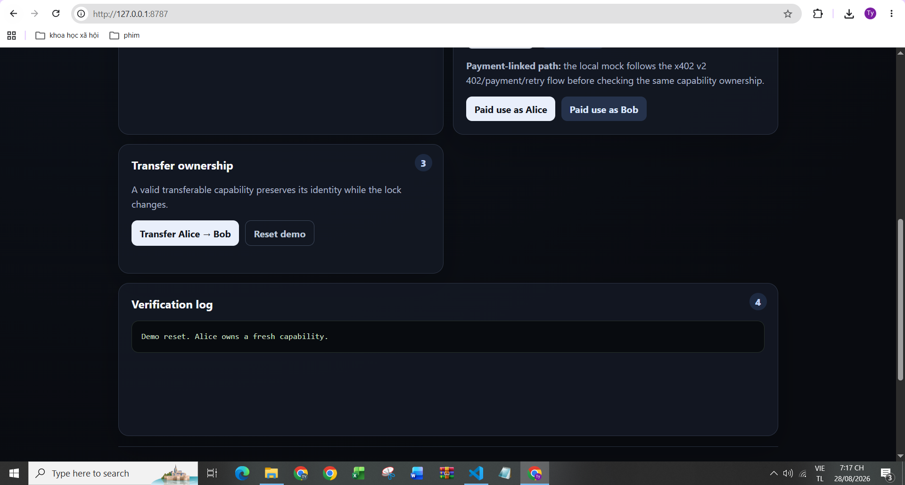
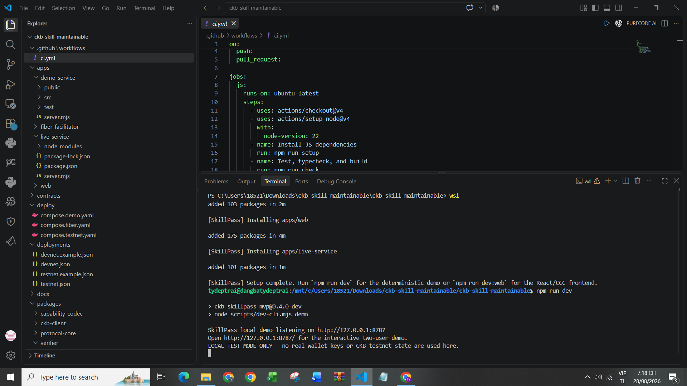

# Week 7 Report — SkillPass

**Week:** 7  
**Date:** 28 August 2026

## Direction

Following Neon’s feedback, I shifted this week from expanding CKBuilder as a developer aid toward **building a user-facing product on CKB**.

I built **SkillPass**, a capability-based access prototype where service access follows ownership of a transferable capability Cell. The goal is to make CKB’s cell model part of the product itself rather than only developer tooling.

## Completed this week

- Built an end-to-end local SkillPass demo.
- Implemented capability ownership checks and transfer flow: **Alice owns → transfer to Bob → Alice loses access → Bob gains access**.
- Added a payment-linked mock path following the **x402 402 → payment → retry** flow as preparation for Fiber integration.
- Made the project easier for other developers to run and maintain with `npm run setup`, `npm run dev`, Docker, environment templates, and CI.
- Kept the demo explicit about its current status: **local simulation only; no claim of a real CKB transaction yet**.

## Evidence

### 1. SkillPass local capability flow



The UI exposes the current capability owner and protected-service flow.

### 2. Transfer and verification flow



The demo includes ownership transfer, reset, and a visible verification log so the access-state change can be checked directly.

### 3. Reproducible local setup



The project installs its dependencies and starts through the top-level developer command:

```bash
npm run setup
npm run dev
```

## Current status

**Demonstrated:** user-facing capability/access flow, transfer semantics, payment-flow structure, and reproducible local execution.

**Not yet claimed:** real on-chain CKB ownership/transfer or real Fiber payment in this local evidence.

## Next step

Move the same flow from local simulation to **real CKB testnet**: deploy the capability script, connect a real CCC wallet, create/transfer the live Cell, and verify that service access follows the new on-chain owner. After that, connect the payment path to **Fiber**.
