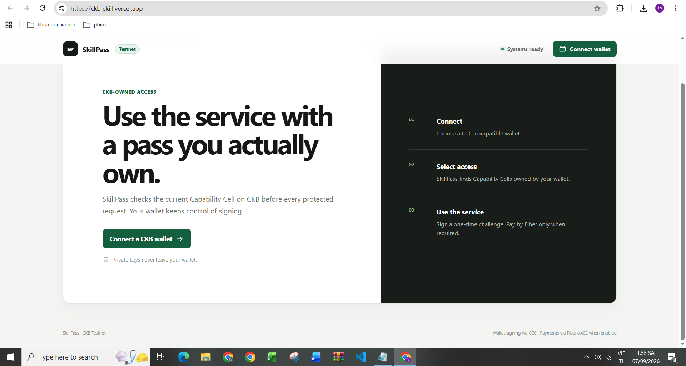

# Week 8 Report — SkillPass

**Week:** 8  
**Date:** 1-6 September 2026

## Direction

Following the Week 7 goal of moving SkillPass from a local simulation toward a real public CKB deployment, I focused this week on making the project reachable and testable by other users.

SkillPass is now publicly deployed on Vercel with a **CKB Testnet** user flow and CCC-compatible wallet connection. The core product idea remains the same: service access follows ownership of a transferable capability Cell, while signing and private keys remain on the user side.

Live application: https://ckb-skill.vercel.app/  
Code: https://github.com/tydeptrai21042004/ckb-skill

I also worked on a **research paper for the company** around verifiable AI computation on Nervos CKB. The draft, *Optimal Cost-Aware Dispute Trees for Verifiable Neural Network Inference on Nervos CKB*, develops the Heterogeneous Neural Dispute Tree (HNDT) formulation and its CellVG realization on CKB. The theoretical draft is in place, while the CKB-VM experiments and code are still being completed.

Paper draft: https://www.overleaf.com/read/nrdbyvjnwghn#920ad1

## Completed this week

- Moved SkillPass from the Week 7 local-only presentation to a **public Vercel deployment**.
- Prepared the project for **CKB Testnet** use and exposed the Testnet status clearly in the UI.
- Added the public CCC-compatible wallet connection entry point.
- Kept the protected-service flow centered on CKB capability ownership:
  **connect wallet → select owned access → sign challenge → use protected service**.
- Improved the deployment path so the frontend/API can be hosted without requiring users to install Node.js, PostgreSQL, Redis, Docker, or run a CKB node on their own computer.
- Hardened the public deployment configuration with request limits, rate limiting, safer environment handling, and fail-closed production settings.
- Continued preparing the Fiber/x402 payment path, while keeping real Fiber payment disabled until the remote payment infrastructure is ready.
- Prepared a company research-paper draft on **cost-aware dispute trees for verifiable neural inference on CKB**, including the HNDT optimization model, Bellman recurrence, dynamic-programming policy, CKB/CellVG realization, and the experimental protocol for CKB-VM measurements.
- Shared the public prototype and paper draft with collaborators/community members to collect feedback on the product direction, UX, security, and research design.

## Evidence

### 1. Public SkillPass deployment on CKB Testnet

The screenshot shows the publicly reachable SkillPass interface at `https://ckb-skill.vercel.app/`, with the application marked as **Testnet**, the system status visible, and the wallet connection flow exposed to users.

The UI also makes the intended access sequence explicit:

1. connect a CCC-compatible wallet;
2. select a capability owned by that wallet;
3. sign a one-time challenge and use the protected service.

### 2. Company research-paper draft

Paper draft: https://www.overleaf.com/read/nrdbyvjnwghn#920ad1

This week I also prepared the theoretical draft of *Optimal Cost-Aware Dispute Trees for Verifiable Neural Network Inference on Nervos CKB*. The paper studies how an optimistic verifier should choose both **where to split a disputed neural execution trace** and **when to stop splitting and verify an interval directly**.

The CKB realization is called **CellVG**. The paper maps the abstract verification costs to CKB-VM cycle accounting, authenticated Cell state, and alternative native/zkVM verification backends. The experimental code is still running, so the final measurement tables are not yet claimed as completed results.

## Current status

**Demonstrated:** public SkillPass deployment, CKB Testnet-facing UI, CCC wallet entry point, capability-based protected-service workflow, public deployment/security hardening, and a research-paper draft connecting verifiable neural inference with CKB.

**Not yet claimed:** a completed real Fiber payment flow, final CKB-VM experimental results for the paper, or that this screenshot alone proves every create/transfer/access transition on-chain. Transaction hashes and explorer/RPC evidence should be retained separately for those claims.

## Next step

- Record explicit **CKB Testnet transaction/explorer evidence** for capability creation and ownership transfer.
- Demonstrate the complete live ownership change:
  **Alice owns → transfer to Bob → Alice loses access → Bob gains access**.
- Connect the payment path to a remotely reachable **Fiber/FNN** service and test a real payment-gated request.
- Finish the CKB-VM benchmark runs and populate the remaining experimental tables in the company paper.
- Compare HNDT/CellVG against the planned fixed midpoint and fixed-granularity baselines using the same measured CKB-VM costs.
- Use feedback from the public SkillPass deployment to decide which capability/service use case should become the first real user-facing application.
