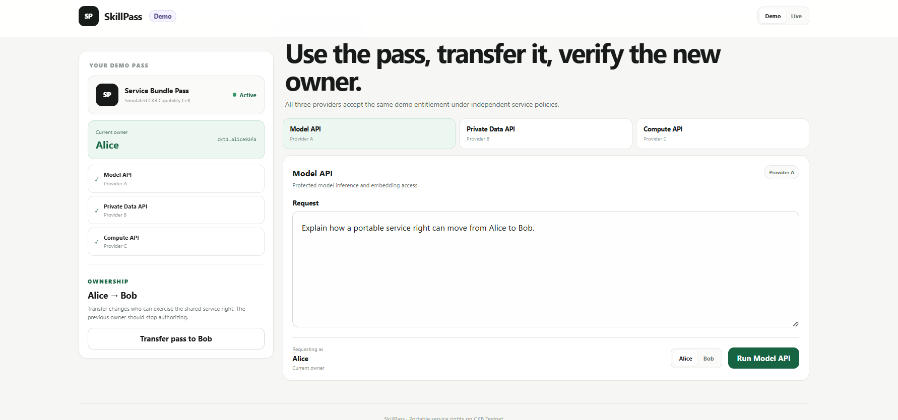

# Week 9 Report — SkillPass: Portable Service Rights on CKB

**Builder:** Dang Ba Ty  
**Track:** Community Keeps Building Builders  
**Project:** SkillPass  
**Repository:** https://github.com/tydeptrai21042004/ckb-skill  
**Public application:** https://ckb-skill.vercel.app/  
**Week:** 9

---

## 1. Summary

This week I narrowed SkillPass from a broad gated-access concept toward a more specific CKB-native direction: **portable service rights on CKB**.

The core idea is that a participating provider issues a transferable Capability Cell that represents a service entitlement. The current owner of that live Cell can use supported services, while providers independently verify the same entitlement under their own policies.

The main Week 9 improvement was not a new blockchain primitive. It was making the product easier to understand, test, and demonstrate without weakening the trusted-issuer model.

A problem in the Week 8 public flow was that a reviewer could connect a JoyID wallet successfully but, if that wallet did not already own a provider-issued pass, the application stopped at **“No pass found.”** This behavior was correct for security, but poor for public demonstration.

In Week 9 I therefore added a clearly separated **Demo Mode** alongside the real **Live Testnet** path.

The demo lets a reviewer immediately experience the ownership lifecycle:

1. Alice starts as the owner of a simulated Service Bundle Pass.
2. Alice can use a protected service.
3. The pass is transferred from Alice to Bob.
4. Alice is then denied.
5. Bob is authorized as the new owner.
6. The same entitlement is shown across multiple independent example providers.

The live path still preserves the real trust model: arbitrary public users cannot self-mint a provider-trusted pass.

---

## 2. Week 8 → Week 9 comparison

| Area | Week 8 | Week 9 |
|---|---|---|
| Product framing | Transferable capability / gated access | **Portable service rights on CKB** |
| Main story | Capability ownership controls protected access | **Ownership follows the service right across providers** |
| Public deployment | Live CKB Testnet app | Live Testnet app + integrated public Demo Mode |
| Wallet experience | Connect JoyID and discover owned Capability Cells | Same live flow, but no-pass users can immediately enter Demo Mode |
| No-pass experience | Dead end: ask provider for a pass | Demo, refresh ownership, or copy wallet address |
| Demoability | Reviewer needed a real pass | Reviewer can test the lifecycle without a wallet or pass |
| Service examples | Earlier generic / older examples | **Model API, Private Data API, Compute API** |
| Ownership lifecycle | Explained in text | **Interactive Alice → Bob transfer and authorization change** |
| Trust model | Provider-issued pass required | Preserved |
| Public self-issuance | Disabled | Still disabled |
| Multi-provider story | Described conceptually | Demonstrated in the UI with one shared entitlement |
| Delegation | Prominent part of the wider idea | Kept optional; ownership/transfer is now the primary story |
| Payment | Separate from entitlement | Still separate; future Fiber/FNN integration remains planned |
| Research | HNDT/CellVG paper started | Continued, with focus on making the work more CKB-specific and experimentally grounded |

The key change from Week 8 is therefore:

> Week 8 proved that SkillPass could run as a public CKB Testnet application.  
> Week 9 focuses on making the **portable-right lifecycle understandable and testable by anyone**, while keeping the real provider-trust boundary intact.

---

## 3. Product direction refined after feedback

Neon pointed out that the broad gated-access space already has related work, including Fiber Latch and other credential / gated-community primitives.

Based on that feedback, I narrowed the intended contribution.

SkillPass is no longer positioned primarily as “another token-gating mechanism.”

Instead, the direction is:

> **A provider-issued service right that is represented by a CKB Cell, can move between owners, and can be independently accepted by multiple providers.**

The distinction I am trying to make is that the Cell is not only an access badge. It is the portable ownership reference for a service entitlement.

When the Cell changes owner, the right should move with it.

This gives the product a clearer CKB-specific story:

- ownership is represented by the live Cell;
- transfer changes the current owner;
- the previous owner should stop authorizing;
- multiple providers can independently accept the same entitlement;
- usage payment can remain a separate concern.

---

## 4. New Demo Mode

The biggest Week 9 usability change is the new integrated demo experience.

### Why it was needed

The Week 8 live flow correctly required a provider-issued pass.

However, a new visitor typically had:

- a valid JoyID wallet;
- no SkillPass Capability Cell;
- no trusted issuer relationship;
- no obvious way to continue.

That meant the reviewer could connect successfully but still could not experience the product.

I did not want to solve this by allowing arbitrary self-issuance, because that would destroy the meaning of a provider-trusted entitlement.

The solution was to split the application into two clearly labeled experiences:

### Demo

- no wallet required;
- no Testnet funds required;
- no blockchain transaction;
- simulated capability lifecycle;
- intended for explanation and evaluation.

### Live

- real JoyID connection;
- real CKB Testnet state;
- real pass discovery;
- real provider trust checks;
- real transfer / authorization path when a compatible pass exists.

This keeps the demo easy while keeping the live security model honest.

---

## 5. Demo evidence

The current Demo Mode presents one simulated **Service Bundle Pass** owned by Alice and accepted by three independent example providers:

- Model API — Provider A
- Private Data API — Provider B
- Compute API — Provider C

The screenshot below is Week 9 evidence from the running UI.



### What this screen demonstrates

The UI now makes the main lifecycle visible without requiring the reviewer to first obtain a live pass.

It shows:

- **Demo** and **Live** as separate modes;
- a simulated CKB Capability Cell;
- the current owner, initially Alice;
- one shared Service Bundle Pass;
- three provider services accepting the same entitlement;
- a direct **Transfer pass to Bob** action;
- protected service execution from the current requester;
- the ability to switch between Alice and Bob for authorization testing.

The intended demo sequence is:

```text
Alice owns pass
      ↓
Alice calls service
      ↓
ACCESS GRANTED
      ↓
Transfer pass to Bob
      ↓
Alice calls service
      ↓
ACCESS DENIED
      ↓
Bob calls service
      ↓
ACCESS GRANTED
```

This is now the shortest explanation of SkillPass.

---

## 6. Multi-provider service-right demo

I also replaced the earlier primary demo framing with three more neutral service examples:

### Model API

Represents protected inference, embedding, or model execution.

### Private Data API

Represents access to provider-controlled data or protected read/query endpoints.

### Compute API

Represents protected compute execution.

These services are examples rather than the product itself.

The important point is that the same Service Bundle entitlement can be accepted independently by several providers.

This makes the product direction more general without returning to vague “generic gated access.”

---

## 7. Improved no-pass UX

In Week 8, the connected-wallet no-pass state mainly told the user that no compatible SkillPass was found and that a provider had to issue one.

That was technically correct, but it created a dead end.

The Week 9 flow now gives the user useful next actions:

- **Try interactive demo**
- **Refresh ownership**
- **Copy wallet address**

This is important because the real live path remains strict.

The application still does **not** let an arbitrary user become a trusted issuer.

A public user can understand the product through Demo Mode, while the live environment continues to enforce provider-issued entitlements.

---

## 8. Security and trust model retained

Week 9 intentionally does not weaken the core trust boundary.

The following rules remain:

- ownership discovery is based on compatible live Capability Cells;
- issuer trust is still checked;
- users cannot self-mint arbitrary trusted passes from the public UI;
- provider policy remains independent;
- entitlement and payment remain separate;
- transfer is intended to move authorization with Cell ownership;
- optional delegation remains a secondary capability.

This is important because an easy demo should not be confused with the real security model.

The UI now makes this distinction more explicit by labeling simulated state as Demo and real state as Live Testnet.

---

## 9. Why this is stronger than the Week 8 presentation

The Week 8 app had the correct architecture but asked the reviewer to understand too much before they could see the core behavior.

Week 9 improves the product demonstration in three ways.

### First: it turns explanation into interaction

Instead of only describing “Alice transfers to Bob,” the reviewer can perform that lifecycle.

### Second: it separates product evaluation from real issuance

A reviewer can learn the system without asking me for a pass first.

### Third: it makes the core CKB claim easier to see

The strongest claim is not simply:

> “A token gates a service.”

It is:

> “The live CKB-owned right is the authorization reference, and when that right moves, service authorization moves with it.”

That is now the center of the demo.

---

## 10. Current architecture

The current product model can be summarized as:

```text
Provider
   │
   │ issues accepted service-right Cell
   ▼
CKB Capability Cell
   │
   │ current ownership
   ▼
Requester
   │
   │ signed protected request
   ▼
Provider verification
   │
   ├── verify entitlement
   ├── verify issuer / policy
   ├── verify current owner
   └── verify optional bounded delegation
   │
   ▼
Protected service
```

Payment is intentionally separate:

```text
Authorization
Who owns or may exercise the service right?

Payment
Has the usage charge for this request been satisfied?
```

This separation is useful for the planned Fiber/FNN integration.

---

## 11. Work completed this week

### Product / UI

- Added a first-class Demo Mode to the main frontend.
- Added clear Demo / Live separation.
- Changed the first-time flow so a pass is not required to understand the product.
- Improved the connected no-pass state.
- Added the Alice → Bob ownership lifecycle.
- Added current-owner authorization testing.
- Added Model API, Private Data API, and Compute API as replaceable provider examples.
- Reduced the prominence of delegation in the main product story.
- Kept transfer and ownership as the central interaction.

### Testing / reliability

- Updated frontend behavior tests for the new demo and no-pass flow.
- Kept the existing trusted-issuer restrictions.
- Preserved the real CKB Testnet discovery path.
- Rechecked the repository after the UI changes.

### Research direction

- Continued work on the verifiable neural-network inference paper.
- Kept the HNDT / CellVG direction centered on cost-aware dispute verification.
- Started thinking more carefully about what should be demonstrated experimentally on CKB rather than only described theoretically.
- Reviewed Ren’s public research page after Neon’s suggestion and prepared to contact him for feedback.

---

## 12. Evidence checklist

| Evidence | Status |
|---|---|
| Public SkillPass deployment | Done |
| JoyID / CKB Testnet live mode | Done |
| Integrated no-wallet Demo Mode | **Done in Week 9** |
| Alice initial ownership | **Done in demo** |
| Protected Model API example | **Done in demo** |
| Private Data API example | **Done in demo** |
| Compute API example | **Done in demo** |
| Alice → Bob simulated transfer | **Done in demo** |
| Old-owner denial after transfer | **Done in demo flow** |
| New-owner authorization | **Done in demo flow** |
| Multi-provider entitlement presentation | **Done** |
| Real Testnet issuance evidence | Still to strengthen |
| Real Alice → Bob Testnet transfer evidence | Next priority |
| Real old-owner rejection after Testnet transfer | Next priority |
| Fiber/FNN payment path | Planned |
| Reusable provider integration package | Planned |

---

## 13. Current limitation

The main remaining weakness is that the clearest Alice → Bob lifecycle is currently easiest to demonstrate in simulated Demo Mode.

The next major step is therefore to capture the same lifecycle with real CKB Testnet evidence:

1. provider issues a valid pass to Alice;
2. Alice is authorized by a protected service;
3. Alice transfers the Capability Cell to Bob;
4. Alice attempts access again and is rejected;
5. Bob attempts access and is accepted;
6. transaction hashes, Cell outpoints, and verification receipts are recorded.

That will connect the improved product UX with strong on-chain evidence.

---

## 14. Next steps

### Priority 1 — Real Testnet ownership-transfer evidence

The most important next milestone is a fully reproducible Alice → Bob live flow.

I want to publish:

- issuance transaction hash;
- Alice-owned Cell outpoint;
- successful Alice authorization evidence;
- transfer transaction hash;
- consumed old outpoint;
- Bob-owned replacement Cell;
- Alice denial receipt;
- Bob authorization receipt.

This is more important than adding more UI features.

### Priority 2 — Reusable provider verifier

I want to separate the authorization logic so another service can integrate SkillPass without using the entire demo application.

The target is a small provider-facing verifier / middleware interface that receives:

- requester proof;
- required entitlement;
- provider policy;
- current CKB capability state;

and returns a clear authorization decision and receipt.

### Priority 3 — Fiber/FNN usage payment

After the ownership lifecycle is strong, I want to connect payment separately.

The key demonstration I want is:

> Alice can still have enough funds to pay after transferring the service right, but payment alone does not authorize her because she no longer owns the entitlement.

This should make the authorization/payment separation concrete.

### Priority 4 — Compare explicitly with related CKB work

Following Neon’s feedback, I want to document where SkillPass overlaps with and differs from:

- Fiber Latch;
- FiberPass-like access concepts;
- credential-based gating;
- proof-of-attendance credentials;
- gated communities.

The purpose is not to claim that transferable access itself is new.

The goal is to identify whether **portable multi-provider service rights whose authorization follows live Cell ownership** are a useful enough abstraction to justify continued development.

### Priority 5 — Strengthen the research work

For the HNDT / CellVG paper, the next work should emphasize:

- CKB-specific verification assumptions;
- small executable experiments;
- cost measurements;
- comparisons against simpler dispute-splitting strategies;
- a clear description of when direct verification is cheaper than further dispute expansion.

I also plan to contact Ren, following Neon’s suggestion, with a short summary and a focused request for technical feedback.

---

## 15. Questions for feedback

The areas where feedback would be most useful are:

1. Is **portable service rights on CKB** a sufficiently useful and differentiated direction compared with existing gating / credential primitives?
2. Is the Alice → Bob ownership-transfer lifecycle the right central demonstration?
3. Should the next engineering milestone prioritize a reusable provider verifier or the Fiber/FNN payment integration?
4. What form of real Testnet evidence would be most convincing to the CKB ecosystem?
5. For the research direction, which CKBA research problems or verification assumptions would make HNDT / CellVG more relevant to Nervos?

---

## 16. Week 9 conclusion

Week 8 was mainly about moving SkillPass from a local prototype to a publicly deployed CKB Testnet application.

Week 9 was about **making the idea demonstrable and narrowing the product direction**.

The strongest change is that a reviewer no longer needs to already own a SkillPass before understanding the system. Demo Mode now lets anyone test the essential lifecycle, while Live Testnet keeps the real provider-trust model intact.

The project is now centered on one concrete claim:

> **A service entitlement can be represented as a CKB-owned right, accepted by participating providers, and when ownership of that right moves, authorization should move with it.**

The next step is to prove that same story with complete real Testnet evidence and then connect usage payment through Fiber/FNN without mixing payment with entitlement ownership.
