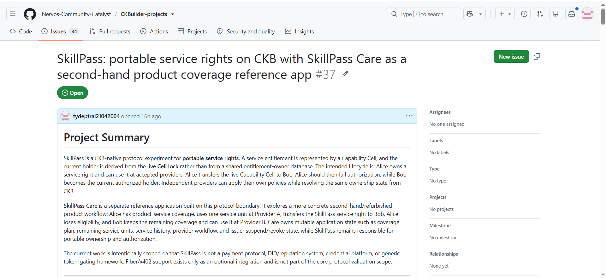
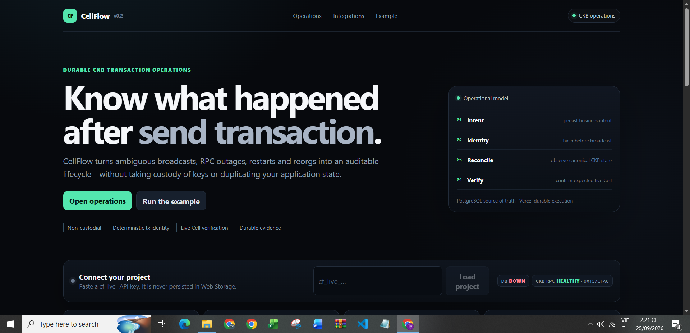

# Week 11 Report — SkillPass, SkillPass Care, and CellFlow

**Builder:** Dang Ba Ty  
**Track:** Community Keeps Building Builders  
**Project:** SkillPass / SkillPass Care / CellFlow  
**SkillPass repository:** https://github.com/tydeptrai21042004/ckb-skill  
**SkillPass public app:** https://ckb-skill.vercel.app/  
**SkillPass Care public app:** https://skill-pass-care-api.vercel.app/  
**CellFlow repository:** https://github.com/tydeptrai21042004/CellFlow  
**Formal CKBuilder feedback issue:** https://github.com/Nervos-Community-Catalyst/CKBuilder-projects/issues/37  
**Week:** 11

---

## 1. Summary

Week 11 focused on three connected goals:

1. **continue improving the two existing projects, SkillPass and SkillPass Care**;
2. **submit SkillPass / SkillPass Care through the formal CKBuilder feedback process requested by Neon**; and
3. **create a new CKB developer-infrastructure project, CellFlow**, focused on durable transaction recovery, reconciliation, and evidence.

The existing SkillPass direction remains unchanged at the protocol level:

> a portable service right is represented by a CKB Capability Cell, and the current holder is derived from live Cell state rather than from a shared entitlement-owner database.

SkillPass Care remains the product-focused reference application:

> remaining service coverage should continue across a product ownership transfer, while Care-specific quota, history, and provider workflow stay outside the base ownership protocol.

The new CellFlow project addresses a separate operational problem:

> after an application sends a CKB transaction, how can it safely recover from RPC timeout, ambiguous broadcast results, serverless restarts, delayed confirmation, or reorgs without blindly rebroadcasting or losing the application intent?

Week 11 therefore did not replace the existing projects. It clarified their boundaries and added a new reusable infrastructure layer for CKB application operations.

---

## 2. Week 10 → Week 11

| Area | Week 10 | Week 11 |
|---|---|---|
| SkillPass | Portable service-right protocol + provider/evidence hardening | Further protocol/funding boundary cleanup, provider verification, conformance and live-state verification focus |
| SkillPass Care | Product-focused reference prototype | Stronger ownership/Care-state separation, concurrency/idempotency hardening, canonical ownership boundary |
| External feedback | Informal/community feedback and technical review | **Formal CKBuilder issue #37 submitted** following Neon's recommendation |
| Funding path | Considering a small DAO Phase 1 | Formal feedback now comes first; DAO scope will be refined after review |
| New infrastructure | Not yet separated | **CellFlow created** as a distinct durable CKB transaction-operations project |
| Testing / reliability | Project-specific verification | CellFlow now includes a larger deterministic lifecycle/reorg/assertion/UI/deployment test suite |
| Main remaining proof | Real Testnet Alice → Bob evidence | Still the highest-priority validation artifact |

The main Week 11 change is therefore **structure and validation discipline**: clearer project boundaries, a formal review path, and a dedicated CKB transaction-operations layer instead of adding unrelated features to SkillPass itself.

---

## 3. Existing SkillPass proposal improved

I continued improving the original SkillPass repository rather than moving all new work into the reference application.

The current SkillPass snapshot keeps the funding candidate intentionally narrow:

1. canonical SkillPass protocol release;
2. real CKB Testnet issuance and Alice → Bob transfer evidence;
3. independently operated provider verification;
4. SkillPass Care as a reference product;
5. external integration and small provider/user validation.

### 3.1 Capability protocol and ownership model

The core model remains CKB-native:

- immutable entitlement identity and policy fields are represented through Capability Cell data / Type Script rules;
- the **live Cell lock** is the authoritative current controller;
- ownership changes through Cell consumption and successor output creation;
- stale state is rejected through live-state/outpoint resolution;
- providers independently verify the same public ownership state.

Capability V2 continues to support application-specific subject/policy commitments without moving mutable Care application state into the base protocol.

### 3.2 Independent provider verification

The current repository includes a stronger provider-facing surface around:

- trusted issuer configuration;
- accepted Capability Type Script deployment;
- provider-owned service policy;
- current live Cell discovery;
- requester/lock ownership checks;
- portable authorization evidence;
- provider conformance testing.

The intention remains that providers should not depend on a shared SkillPass entitlement-owner database.

### 3.3 Clearer funding and non-goal boundary

The current repository explicitly treats delegation, agent SDKs, service gateway extensions and Fiber/x402 settlement as optional extensions rather than Phase-1 acceptance requirements.

The core funding proof is still much narrower:

```text
Alice owns live Capability Cell
        |
        +--> Provider A: ALLOW
        +--> Provider B: ALLOW
        |
        | transfer on CKB
        v
Bob owns successor Cell
        |
        +--> Alice: DENY
        +--> Bob @ Provider A: ALLOW
        +--> Bob @ Provider B: ALLOW
```

This narrower boundary makes the project easier to review and keeps the CKB-specific claim testable.

---

## 4. SkillPass Care improved

SkillPass Care remains a separate reference application built around the SkillPass ownership boundary.

The current Care design keeps two kinds of state separate:

### SkillPass / CKB state

Authoritative for:

- current portable-right owner;
- live ownership state;
- ownership transfer;
- stale-owner rejection.

### SkillPass Care application state

Authoritative for:

- product commitment;
- Care plan;
- remaining service units;
- service history;
- provider workflow;
- issuer suspension/revocation.

This means Care does not become the shared entitlement-owner database.

### 4.1 Current reference lifecycle

```text
STANDARD_90D issued to Alice
3 service units
        |
        +--> Provider A verifies Alice
        +--> Alice uses one service unit
              3 -> 2

Alice transfers the SkillPass right to Bob
        |
        +--> Alice's old ownership becomes stale

After transfer
        |
        +--> Alice: DENY
        +--> Provider B verifies Bob
        +--> Bob uses one service unit
              2 -> 1
```

### 4.2 Reliability work in the current Care snapshot

The current repository includes additional hardening around:

- owner-approved request binding;
- typed service-event records;
- before/after version tracking;
- request/evidence identity binding;
- exact-retry idempotency;
- conflict detection for changed retry details;
- shared transition logic between memory and PostgreSQL stores;
- row locking plus optimistic versioning;
- atomic service-event insertion;
- ownership re-check before service consumption;
- serialized in-memory entitlement mutations;
- cross-provider Alice/Provider A → Bob/Provider B continuity tests.

The canonical CKB production mode intentionally remains **fail closed** unless a real `SkillPassOwnershipPort` is supplied.

That is important because a production-looking Care UI should not be presented as proof that canonical CKB ownership is already connected.

---

## 5. Formal CKBuilder feedback process

Following Neon's recommendation, I submitted SkillPass / SkillPass Care through the formal CKBuilder project-review process:

https://github.com/Nervos-Community-Catalyst/CKBuilder-projects/issues/37

The issue keeps the boundary explicit:

- **SkillPass** = portable service-right ownership and authorization layer;
- **SkillPass Care** = second-hand/refurbished product-coverage reference application.

The main questions submitted for feedback include:

- whether the Capability Cell lifecycle is sufficiently clear and CKB-native;
- whether live-owner authorization is defined correctly;
- how much real Testnet evidence should be required before funding discussion;
- what providers should independently pin and verify;
- how the SkillPass / Care boundary should be kept narrow;
- whether the second-owner product-coverage use case is a strong reference application.

This formal review now comes before any DAO proposal.

### Evidence — formal CKBuilder submission



The screenshot shows the submitted CKBuilder-projects issue **#37** with the SkillPass / SkillPass Care project summary.

---

## 6. New project — CellFlow

Week 11 also introduced **CellFlow**, a separate CKB-native developer-infrastructure project.

CellFlow is not another entitlement protocol. It addresses transaction operations after an application has already built/signed a transaction.

Its role is:

```text
CKB application / wallet
        |
        | build + sign transaction
        v
CellFlow
        |
        +--> persist business intent
        +--> know tx identity before broadcast
        +--> reconcile CKB RPC state
        +--> survive restart / ambiguous response
        +--> wait for project confirmation policy
        +--> verify expected Cell state
        +--> emit evidence / signed webhook
```

### 6.1 Main implemented capabilities

The current V0.2 snapshot includes:

- strict TypeScript state-machine/domain layer;
- PostgreSQL/Neon durable repository;
- `(project_id, intent_id)` idempotency;
- separated **submission**, **chain**, and **workflow** status axes;
- CKB RPC reconciliation;
- one RPC endpoint per observation;
- configurable confirmation policy;
- explicit reorg handling;
- deterministic transaction identity before broadcast;
- ambiguous-submit recovery without blind rebroadcast;
- expected output Cell assertions;
- current live-Cell verification;
- atomic state/event/webhook outbox writes;
- webhook/reconciliation leases;
- optimistic concurrency retry;
- encrypted per-endpoint webhook secrets;
- signed webhook delivery;
- deterministic evidence export;
- Vercel Workflow durable reconciliation;
- Vercel Cron repair path;
- operator CLI;
- API-key and webhook management;
- production-style operations dashboard;
- local-only SkillPass Alice → Bob walkthrough.

### 6.2 Current test coverage

The current CellFlow snapshot reports **47 deterministic tests** covering:

- transaction lifecycle transitions;
- ambiguous submission;
- reorg handling;
- confirmation depth;
- expected Cell assertions;
- live Cell assertions;
- hardening contracts;
- UI/deployment contracts.

The focus is not just whether the happy path works, but whether the system remains consistent across retries, failures, and duplicated serverless workers.

### Evidence — deployed CellFlow operations UI



The screenshot demonstrates the deployed CellFlow V0.2 operations interface, including the durable transaction-operations model, project connection area, and CKB RPC health surface.

**Evidence boundary:** in this captured screen, the UI shows `CKB RPC HEALTHY` while the database indicator is `DB DOWN`. Therefore this screenshot is evidence of the deployed CellFlow UI and RPC-facing operations surface, **not** evidence that the database persistence layer was healthy at the exact moment of capture.

---

## 7. Project boundaries after Week 11

The three projects now have clearer and non-overlapping responsibilities:

| Project | Main responsibility |
|---|---|
| **SkillPass** | Portable service-right ownership and authorization on CKB |
| **SkillPass Care** | Product-specific coverage, quota, service history, issuer/provider workflow |
| **CellFlow** | Durable CKB transaction lifecycle, recovery, reconciliation, expected-state verification and evidence |

The simplest distinction is:

```text
SkillPass
   = who currently controls the portable service right?

SkillPass Care
   = what product/service coverage remains and what has been consumed?

CellFlow
   = what happened to the CKB transaction and expected Cell state?
```

This separation is intentional. CellFlow should not become SkillPass, and SkillPass should not become a generic transaction workflow engine.

---

## 8. Important honesty boundary

Week 11 improves implementation quality and project structure, but several important claims are still intentionally **not** treated as complete.

### Demonstrated / implemented

- public SkillPass application;
- product-focused SkillPass Care application;
- formal CKBuilder feedback issue #37;
- provider-verification and evidence-oriented SkillPass architecture;
- Care application-state / ownership-state separation;
- CellFlow durable transaction-operations implementation;
- CellFlow production-style UI and deterministic test suite.

### Still not claimed as complete

- final real CKB Testnet SkillPass issuance + Alice → Bob transfer evidence;
- retained transaction/outpoint evidence proving the full ownership transition;
- externally operated provider using the canonical live SkillPass state;
- production Care binding to a real canonical SkillPass ownership adapter;
- that the CellFlow UI screenshot alone proves every persistence/reconciliation path in a live production environment.

The next phase should close these validation gaps rather than add broad new feature categories.

---

## 9. Week 11 evidence checklist

| Evidence | Status |
|---|---|
| SkillPass repository improved | Done in current snapshot |
| SkillPass provider-verification / conformance direction | Done in current snapshot |
| SkillPass Care repository improved | Done in current snapshot |
| Care ownership/application-state boundary | Done in current snapshot |
| Formal CKBuilder feedback issue #37 | **Done** |
| CKBuilder issue screenshot | **Included** |
| New CellFlow project | **Done** |
| CellFlow durable lifecycle/recovery implementation | Done in current snapshot |
| CellFlow operations UI | **Deployed / screenshot included** |
| CellFlow deterministic tests | **47 reported in current snapshot** |
| Real SkillPass Alice → Bob Testnet transaction evidence | **Not complete; next priority** |
| Independent external provider using live canonical SkillPass state | **Not complete; next priority** |
| Production Care → canonical SkillPass binding | **Not complete; fail-closed by design** |

---

## 10. What I learned this week

### Formal feedback should come before funding discussion

Neon's recommendation helped clarify the process. The correct next step is to let the formal CKBuilder review and forum discussion produce technical recommendations before finalizing a DAO proposal.

### Related products still need explicit boundaries

SkillPass and SkillPass Care are related, but they should not be presented as the same system. SkillPass is the ownership/authorization protocol; Care is a vertical product with its own mutable business state.

### Operational reliability is a separate infrastructure problem

The CellFlow work showed that transaction submission, ownership protocol design, and application business state are different concerns.

A CKB application may know exactly what transaction it wants to send and still need a durable answer to:

> was the transaction submitted, observed, committed, reorged, confirmed, and did the expected Cell remain live?

This deserves a reusable layer rather than being reimplemented independently in every application.

### Testnet evidence remains more valuable than another feature expansion

The main remaining proof for SkillPass is still the same: a reproducible real-chain Alice → Bob lifecycle with retained evidence and independent provider verification.

---

## 11. Next steps

### Priority 1 — Real SkillPass Testnet lifecycle

Complete and retain evidence for:

1. issue one real service-right Cell;
2. Alice is the initial live owner;
3. Provider A independently verifies Alice;
4. Alice transfers the Cell to Bob;
5. the old Alice outpoint becomes stale;
6. Alice is denied after confirmation;
7. Bob is accepted;
8. Provider B independently reaches the same ownership result.

### Priority 2 — Connect Care to canonical SkillPass ownership

Use the canonical SkillPass ownership result as the ownership authority while leaving Care quota/history/provider workflow in Care's own application state.

### Priority 3 — Use CellFlow for retained transaction evidence

Use CellFlow to record:

- business intent;
- deterministic transaction identity;
- submission/reconciliation states;
- confirmation depth;
- expected/live Cell checks;
- evidence export.

This would make the real SkillPass Testnet lifecycle easier to audit and reproduce.

### Priority 4 — Respond to CKBuilder issue #37 feedback

Convert external review comments into:

- protocol changes;
- explicit non-goals;
- Testnet acceptance criteria;
- funding-scope revisions.

### Priority 5 — External provider validation

Ask at least one external reviewer/provider to run the verifier independently rather than relying only on the main application deployment.

---

## 12. Questions for community / mentor feedback

1. Does the current split between **SkillPass**, **SkillPass Care**, and **CellFlow** make the project boundaries clearer?
2. For the first funding milestone, what minimum real Testnet evidence would be considered sufficient for the Alice → Bob ownership lifecycle?
3. Should SkillPass Care remain only a reference application, or is the product-coverage direction strong enough to be evaluated as a separate product proposal later?
4. Is CellFlow's focus on ambiguous-submit recovery, reconciliation, live-Cell verification, and evidence sufficiently distinct from existing CKB developer tooling?
5. Which one of these three areas should receive the strongest focus before any DAO proposal is submitted?

---

## 13. Week 11 conclusion

Week 11 was mainly about **hardening, clearer project boundaries, and formal validation**.

I improved the two existing projects:

- **SkillPass** as the CKB-native portable service-right protocol;
- **SkillPass Care** as the second-hand/refurbished product-coverage reference application.

I also followed Neon's recommendation and submitted the work through the formal CKBuilder feedback process in issue #37.

Finally, I created **CellFlow** as a separate CKB transaction-operations layer for durable intent tracking, ambiguous-submit recovery, reconciliation, expected/live Cell verification, and audit evidence.

The current direction can be summarized as:

> **SkillPass determines portable ownership, SkillPass Care manages product-specific service state, and CellFlow makes the underlying CKB transaction lifecycle durable and auditable.**

The next milestone should be a reproducible real CKB Testnet lifecycle with retained transaction/outpoint evidence and independent provider verification, using the formal feedback from issue #37 to refine the exact acceptance criteria.
