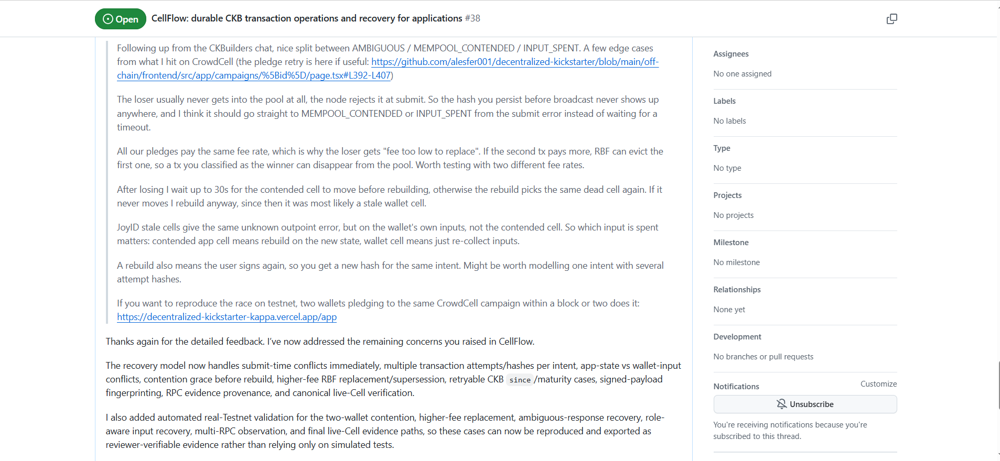
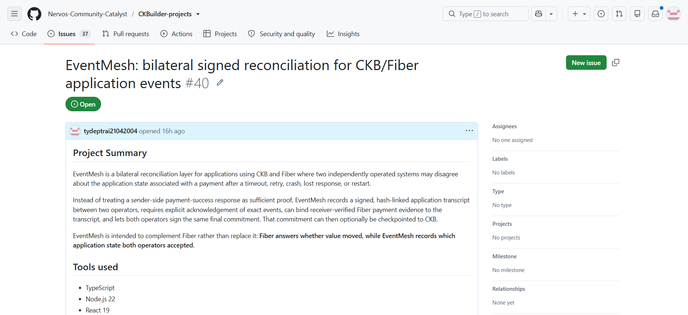

# Week 12 Report — Feedback-Driven CellFlow Hardening and EventMesh Validation Proposal

**Builder:** Dang Ba Ty  
**Track:** Community Keeps Building Builders  
**Projects:** SkillPass / SkillPass Care / CellFlow / EventMesh  
**SkillPass repository:** https://github.com/tydeptrai21042004/ckb-skill  
**SkillPass public app:** https://ckb-skill.vercel.app/  
**SkillPass Care public app:** https://skill-pass-care-api.vercel.app/  
**CellFlow repository:** https://github.com/tydeptrai21042004/CellFlow  
**CellFlow public app:** https://cellflow-brown.vercel.app/  
**CellFlow CKBuilder feedback issue:** https://github.com/Nervos-Community-Catalyst/CKBuilder-projects/issues/38  
**EventMesh public app:** https://eventmesh-tan.vercel.app/  
**EventMesh CKBuilder feedback issue:** https://github.com/Nervos-Community-Catalyst/CKBuilder-projects/issues/40  
**Week:** 12  
**Date:** 1 October 2026

---

## 1. Summary

Week 12 was mainly about **responding to external feedback instead of adding features without validation**.

Two things changed the direction of the work this week:

1. **CellFlow received concrete technical feedback from a CKB builder based on CrowdCell transaction-contention experience.** The feedback identified several cases that a simple timeout/retry model does not cover well: submit-time rejection before a transaction reaches the mempool, higher-fee replacement, contention grace before rebuilding, different recovery for application-state inputs versus wallet funding inputs, and multiple transaction hashes for one business intent.
2. **I proposed a new application-level experiment, EventMesh, through the formal CKBuilder feedback process.** EventMesh is intentionally being treated as a validation hypothesis rather than a grant-ready project. Its question is whether there is a recurring CKB/Fiber case where both sides agree that payment occurred but still disagree about the application state associated with that payment.

This follows the feedback I received from Neon that the important question for a future proposal is not only whether the implementation is technically interesting, but whether there is **real community demand and a problem that is not already solved by a simpler approach**.

The Week 12 direction is therefore:

> **use external feedback to make CellFlow narrower and more correct, while treating EventMesh as a demand-validation experiment until a concrete recurring use case is demonstrated.**

SkillPass and SkillPass Care remain separate from both projects and are not expanded in order to absorb these new concerns.

---

## 2. Week 11 → Week 12

| Area | Week 11 | Week 12 |
|---|---|---|
| **SkillPass** | Portable service-right protocol under formal review | Core direction unchanged; no broad new feature category added |
| **SkillPass Care** | Reference product for portable product/service coverage | Remains a separate application boundary |
| **CellFlow** | New durable CKB transaction-operations project | **External CrowdCell feedback converted into concrete recovery-model changes and regression cases** |
| CellFlow transaction identity | One durable intent with deterministic transaction identity | One durable intent can retain **multiple signed attempts / hashes** after rebuild or replacement |
| CellFlow conflict model | Ambiguous submit / input conflict separation | Submit-time contention, app-state vs wallet-input roles, contention grace, RBF candidate handling, provenance and live-Cell evidence strengthened |
| External validation | CKBuilder issue #38 submitted | Concrete review feedback addressed in the implementation; real Testnet evidence publication remains outstanding |
| New application | None | **EventMesh proposed through CKBuilder issue #40** |
| Funding direction | Formal feedback before proposal | Stronger emphasis on **demand validation and comparison with simpler alternatives** |

The important difference is that Week 12 is not primarily a feature-expansion week. It is a **feedback-to-design** week.

---

## 3. CellFlow — concern raised by external review

A reviewer on the CellFlow CKBuilder issue shared a concrete transaction-race case from CrowdCell.

The main concerns were:

1. **A losing transaction may never enter the mempool.** The node can reject it immediately at submit time, so waiting for the persisted hash to appear on-chain or time out is unnecessary.
2. **Higher-fee RBF can change the apparent winner.** A transaction that looked like the active candidate can disappear from the mempool if another conflicting transaction replaces it with a higher fee.
3. **Immediate rebuild can reuse the same dead state.** The reviewer waits roughly 30 seconds for the contended Cell to move before rebuilding.
4. **Which input was spent matters.** A spent application-state Cell may require rebuilding against new application state, while a stale JoyID/wallet funding Cell may only require recollecting funding inputs.
5. **One business intent can have multiple signed transaction hashes.** A rebuild requires another signature and therefore another transaction identity for the same application intent.

This was useful because it moved the discussion from a generic “transaction timeout” problem to CKB-specific operational cases involving live Cells, shared inputs, wallet inputs, mempool contention and replacement.

---

## 4. CellFlow — changes made in response

I updated the CellFlow recovery model so that these cases are represented explicitly rather than being collapsed into a generic retry path.

### 4.1 Submit-time conflicts are handled immediately

The broadcast path now distinguishes a node-side rejection that looks like contention/dead-input/RBF conflict from a normal ambiguous network response.

The intended flow is:

```text
send_transaction
      |
      +--> accepted / ambiguous network outcome
      |       -> reconcile by known tx hash
      |
      +--> conflict-looking node rejection
              -> inspect the exact inputs immediately
              -> classify contention / spent-input evidence
              -> choose recovery from the evidence
```

A submit error alone is not treated as proof of canonical spend, but it can trigger immediate conflict reconciliation rather than waiting for a normal timeout.

### 4.2 One intent can keep multiple transaction attempts

CellFlow now models one durable business intent with several transaction attempts when a rebuild or replacement is necessary.

```text
business intent
     |
     +--> attempt #1 / txHash A
     |
     +--> rebuild / txHash B
     |
     +--> RBF candidate / txHash C
     |
     `--> canonical evidence determines the final outcome
```

The old hashes are retained as evidence rather than overwritten.

### 4.3 Input roles affect recovery

The recovery model now preserves input roles so that CellFlow can distinguish, for example:

```text
application-state input spent
    -> application state may have advanced
    -> rebuild against the new live state

wallet funding input spent/stale
    -> business state may still be valid
    -> recollect funding inputs and sign again
```

This directly addresses the feedback that the same “unknown outpoint” style failure can mean different things depending on which input is no longer live.

### 4.4 Explicit contention grace

A short configurable contention-grace period is now represented before rebuilding a transaction against a contended application Cell.

The current design uses an approximately **30-second default** as a policy value, not as a CKB protocol rule.

The purpose is to reduce the chance of immediately rebuilding against the same state while the competing transaction is still being resolved.

### 4.5 Higher-fee RBF is candidate-aware

A replacement attempt is not treated as automatically canonical just because it was submitted with a higher fee.

The model retains potentially live candidates and requires shared-input evidence for an RBF replacement relationship. Reconciliation/chain evidence is still responsible for deciding which attempt actually survives.

### 4.6 Stronger evidence retained per attempt

The current repository also adds stronger evidence surfaces around the same recovery model, including:

- signed-payload fingerprints;
- per-attempt input evidence;
- RPC observation provenance;
- candidate/replacement relationships;
- canonical block observations;
- expected output and current live-Cell verification.

These additions make it easier to explain *why* CellFlow chose a recovery action instead of only reporting a final status.

---

## 5. CellFlow validation added, with an explicit evidence boundary

I also added automated paths for reproducing the review cases, including:

- two-wallet same-application-state contention;
- a higher-fee replacement/RBF scenario;
- ambiguous-response recovery;
- role-aware input recovery;
- multi-RPC observation/provenance;
- final expected/live-Cell evidence.

The important distinction is:

> **the repository now contains the harnesses and regression cases, but I am not treating that as equivalent to already publishing a complete real-Testnet evidence bundle.**

The remaining evidence task is to run the live scenarios, retain the transaction/outpoint/RPC artifacts, and publish a reviewer-verifiable bundle.

### Evidence — CellFlow feedback and follow-up



The capture shows the concrete CrowdCell-derived concerns in issue **#38** and my follow-up describing the recovery-model changes made in response.

---

## 6. Why this makes CellFlow more specific

One concern raised during the broader discussion was whether a simple worker that checks transaction status is already sufficient for common CKB/Fiber applications.

That simpler design is still the correct answer for simple cases.

CellFlow is only justified when an application needs to preserve more information across uncertainty, such as:

```text
one application intent
     |
     +--> several signed transaction attempts
     +--> shared application-state input contention
     +--> independent wallet-funding input failures
     +--> possible RBF replacement
     +--> restart/redeploy recovery
     +--> canonical/live-Cell settlement evidence
```

The CrowdCell feedback gives one concrete external example of these edge cases. It does **not** by itself prove broad ecosystem demand, so broader adoption/validation is still required before making a funding claim.

---

## 7. New application proposal — EventMesh

This week I also proposed a separate experimental application called **EventMesh** and submitted it through the CKBuilder feedback process:

https://github.com/Nervos-Community-Catalyst/CKBuilder-projects/issues/40

EventMesh is intentionally **not another transaction lifecycle system**.

Its working problem statement is:

> a Fiber payment can succeed, but after a timeout, retry, crash or lost response, two independently operated application services may still disagree about which request, result version or final application state that payment actually settled.

The proposed reference flow is:

```text
signed request
      ↓
explicit acknowledgement
      ↓
signed result commitment
      ↓
delivery completion
      ↓
dual-signed final application state
      ↓
optional compact CKB checkpoint
```

Fiber remains the payment-evidence layer. EventMesh is only responsible for the explicit bilateral application agreement around that payment.

---

## 8. EventMesh boundary against existing projects

The current project boundaries are:

| Project | Responsibility |
|---|---|
| **SkillPass** | Who currently controls a portable service entitlement? |
| **SkillPass Care** | What product-specific coverage/quota/history remains? |
| **CellFlow** | What happened to a CKB transaction and the expected Cell state? |
| **Fiber** | Did value move / what is the payment state? |
| **EventMesh** | What exact application event/result/final state did two independent operators both accept? |
| **CKB checkpoint** | Optional durable commitment to the final proof |

The simplest non-overlap statement is:

```text
Fiber:      did value move?
CellFlow:   what happened to the CKB transaction / Cell state?
EventMesh:  what application state did both operators agree on?
```

EventMesh therefore should not implement Fiber routing, wallet logic, payment retry, transaction recovery, or a generic event bus.

---

## 9. EventMesh is a validation proposal, not yet a funding claim

The most important feedback on EventMesh is also the simplest challenge:

> in many applications, a payment reference plus ordinary application logs may already be enough.

I agree with that concern.

For that reason, I am not using Week 12 to expand EventMesh into a large protocol. The correct next step is to compare it against the simplest alternative in concrete workflows.

The key validation question is:

> **Can I identify a recurring CKB/Fiber workflow where both parties agree the payment occurred, but a payment reference and normal backend logging are insufficient to determine which application state both parties accepted?**

If the answer is no, EventMesh should be narrowed or stopped rather than forced into a grant proposal.

### Evidence — EventMesh submitted for formal feedback



The capture shows the formal CKBuilder issue **#40**, where EventMesh is presented as **bilateral signed reconciliation for CKB/Fiber application events**.

---

## 10. EventMesh implementation direction currently being tested

The current repository is built around a small reference protocol rather than a general messaging platform:

- two independent operator identities;
- signed, hash-linked application events;
- explicit ACK/REJECT of exact event hashes;
- stale-write, conflicting-ACK and fork detection;
- receiver-side Fiber payment verification;
- payment-to-session/purpose binding;
- deterministic final-state derivation;
- dual-signed close/final commitment;
- optional CKB commitment;
- standalone verification and evidence export;
- crash/retry/reconciliation paths.

The repository deliberately describes this as a **gap worth validating**, not as a proven broad market.

There is also a practical product issue to resolve later: **“EventMesh” is a working project name and collides with the existing Apache EventMesh name**, so a wider launch would need a different public name even if the experiment is validated.

---

## 11. Week 12 evidence checklist

| Evidence / work item | Status |
|---|---|
| CellFlow formal feedback issue #38 | Existing / active |
| Concrete CrowdCell contention/RBF feedback | **Received** |
| Submit-time conflict reconciliation | **Implemented in current CellFlow snapshot** |
| Multiple transaction attempts per intent | **Implemented in current CellFlow snapshot** |
| App-state vs wallet-input recovery distinction | **Implemented in current CellFlow snapshot** |
| Configurable contention grace | **Implemented in current CellFlow snapshot** |
| Candidate-aware higher-fee RBF handling | **Implemented in current CellFlow snapshot** |
| Signed-payload fingerprint / RPC provenance | **Implemented in current CellFlow snapshot** |
| Real-Testnet reproduction harnesses | **Present in current CellFlow snapshot** |
| Published live Testnet evidence bundle for those scenarios | **Not yet complete** |
| EventMesh experimental application | **Created** |
| EventMesh formal CKBuilder issue #40 | **Submitted** |
| EventMesh signed request/ACK/result/final-state model | **Implemented as reference design** |
| Independent evidence of recurring EventMesh demand | **Not yet established** |
| EventMesh funding request | **Not proposed; validation first** |
| Two Week 12 evidence captures | **Included in this report** |

---

## 12. What I learned this week

### External failure cases are more useful than adding generic features

The CrowdCell feedback immediately exposed several cases that were easy to miss in a generic transaction-status model: a loser rejected before entering the pool, replacement, stale funding Cells, delayed state movement, and multiple signatures for one intent.

Those comments produced a more precise CellFlow model than simply adding another dashboard feature.

### A simple solution should remain the baseline

For both CellFlow and EventMesh, the correct comparison is not “can I build a more complete system?” It is:

> **when is the simpler worker / payment reference / ordinary backend log insufficient?**

If the simpler approach solves the target workflow reliably, the larger protocol should not be used.

### One concrete external case is useful, but not the same as ecosystem demand

The CrowdCell case is valuable evidence that Cell-level contention and retry semantics can become more complicated than a single timeout worker.

However, one example is not enough to claim that every CKB application needs CellFlow. The next stage should identify additional adopters or integrations.

### EventMesh needs demand proof before scope growth

EventMesh can be technically coherent and still be unnecessary. Its next milestone should therefore be a real independent workflow and failure reproduction, not additional protocol surface.

---

## 13. Next steps

### Priority 1 — Publish the CellFlow Testnet evidence bundle

Run and retain reviewer-verifiable evidence for the scenarios already modeled:

1. two-wallet application-state contention;
2. submit-time loser rejection;
3. contention-grace behavior;
4. wallet-funding stale-input recovery;
5. higher-fee replacement/RBF candidate behavior;
6. ambiguous response recovery;
7. multi-RPC/canonical observation;
8. final expected/live-Cell verification.

The evidence should retain transaction hashes, input OutPoints, RPC observations, timestamps, candidate relationships and final live-Cell state.

### Priority 2 — Validate CellFlow with another CKB application

Ask another builder to identify whether they currently handle one of these scenarios manually and, if possible, integrate only the smallest reusable CellFlow boundary needed for that case.

The goal is to determine whether CellFlow should become:

- a lightweight reusable TypeScript recovery library;
- a hosted operations service;
- or remain a project-specific pattern if broad demand is weak.

### Priority 3 — Keep EventMesh narrow and test one real workflow

Choose one independent two-operator CKB/Fiber workflow and compare:

```text
A. payment reference + normal logs
vs
B. signed EventMesh reconciliation
```

The comparison should measure what failure/dispute state exists after a crash/retry and whether EventMesh actually resolves information that the simpler approach cannot.

### Priority 4 — Ask concise external questions

Following Neon's suggestion, ask Retric / Hanssen a short question centered on observed need rather than implementation detail:

> Have you seen a CKB/Fiber application where payment was known to have succeeded, but two independently operated services still disagreed about which application request/result/final state the payment settled?

### Priority 5 — Keep SkillPass work separate

Continue the existing SkillPass / SkillPass Care validation path without pulling CellFlow or EventMesh responsibilities into the Capability protocol.

---

## 14. Questions for community / mentor feedback

1. Does the CrowdCell case make CellFlow's scope more concrete, or would you still recommend reducing it to a smaller reusable recovery component?
2. Which CellFlow scenario would be the strongest external validation target after the published Testnet evidence: contention, higher-fee RBF, wallet-input recovery, or ambiguous broadcast?
3. For EventMesh, have you seen a real case where **payment is agreed but application state is not**?
4. In that case, what is currently used: a payment reference, application database, signed receipt, shared service, or another mechanism?
5. What evidence would justify continuing EventMesh rather than stopping at the simpler alternative?
6. Of SkillPass, SkillPass Care, CellFlow and EventMesh, which direction currently shows the clearest community need worth concentrating on during the extension period?

---

## 15. Week 12 conclusion

Week 12 was a **feedback-driven validation week**.

For **CellFlow**, I used the concrete CrowdCell feedback to move beyond a generic timeout/retry model. The current design now explicitly represents submit-time conflicts, multiple attempts for one intent, input roles, contention grace, candidate-aware RBF handling, signed-payload evidence, RPC provenance and final live-Cell verification. The remaining important task is to publish the real Testnet evidence instead of treating the implementation alone as proof.

For **EventMesh**, I created and submitted a new application-level reconciliation experiment through CKBuilder issue #40. Its boundary is intentionally different from CellFlow and Fiber: it asks what exact application state two independent operators both accepted, not whether a transaction or payment succeeded. At the same time, Neon's simpler-alternative concern remains central, so EventMesh should only continue if concrete builder workflows show that payment references and ordinary logs are insufficient.

The current direction can be summarized as:

> **CellFlow is being hardened from real CKB transaction-contention feedback; EventMesh is being tested as a new application hypothesis; and both must earn their scope through external evidence and demand before any funding proposal is considered.**
