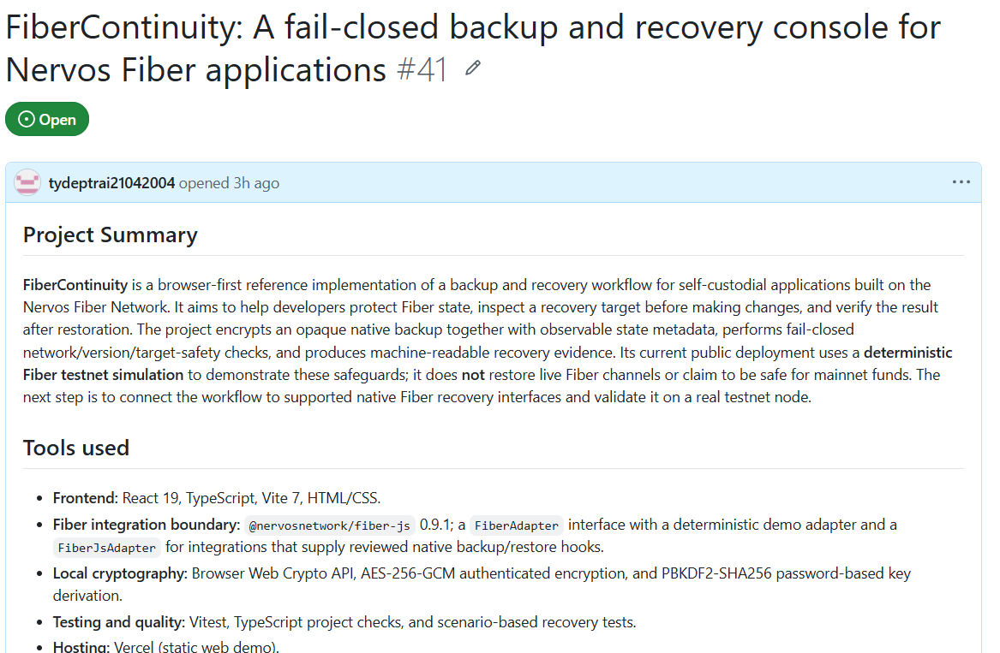
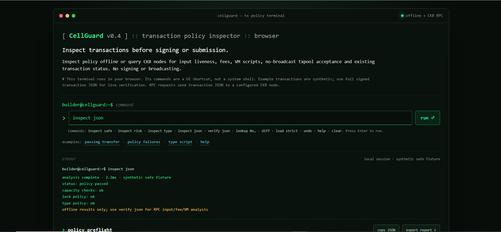

# Week 13 Report — Recovery Safety, Transaction Preflight, and CKB Research Outreach

**Builder:** Dang Ba Ty  
**Track:** Community Keeps Building — Builders  
**Week:** 13  
**Date:** 8 October 2026  
**Repository:** https://github.com/tydeptrai21042004/ckb-skill  
**Previous report:** [Week 12](./week-12-report.md)

## 1. Summary

This week extends the feedback-first direction established in Week 12. I submitted **FiberContinuity** for CKBuilder feedback, continued the **CellGuard** transaction-preflight tool, and submitted a CKB-focused research paper to an academic journal. These are different forms of progress: a project-review submission, a publicly demonstrated developer-tool interface, and a manuscript receipt. None should be presented as approval, production validation, a funded grant, or journal acceptance.

My overall goal remains to learn which CKB developer problems recur in real applications and can be demonstrated with independently reproducible evidence. I am **not** treating every new experiment as a simultaneous funding proposal.

## 2. Week 12 → Week 13

| Area | Week 12 baseline | Week 13 evidence and next step |
|---|---|---|
| CellFlow | Contention and retry model improved in response to developer feedback | Keep changes focused; publish real-Testnet contention/recovery evidence, still pending |
| EventMesh | Bilateral application-state reconciliation proposed for feedback, issue #40 | Maintain demand-validation hypothesis; no claim of grant readiness |
| SkillPass / Care | Portable-right Alice → Bob lifecycle remains central | Continue real Testnet transfer and independent provider-verification evidence; no unverified live lifecycle claim |
| FiberContinuity | Not included in the Week 12 report | Submitted for CKBuilder feedback as issue #41; current public demo is a deterministic Fiber testnet **simulation** |
| CellGuard | Not included in the Week 12 report | Browser-first pre-signing/pre-submission transaction policy inspector; screenshot of a synthetic offline fixture |
| Research | Not covered in Week 12 | Academic manuscript submission acknowledged by *Science of Computer Programming*; editorial decision not yet reported |

## 3. FiberContinuity — new CKBuilder submission (#41)

**Review issue:** https://github.com/Nervos-Community-Catalyst/CKBuilder-projects/issues/41

FiberContinuity explores a **fail-closed backup and recovery console for self-custodial applications using the Nervos Fiber Network**. The proposed workflow encrypts an opaque native backup together with observable state metadata, checks network/version/recovery-target safety before change, and emits machine-readable evidence for review after recovery.

The published issue describes React/TypeScript/Vite, `@nervosnetwork/fiber-js` 0.9.1, a `FiberAdapter` boundary, browser Web Crypto (AES-256-GCM and PBKDF2-SHA256), and Vitest. **At present the public browser demo uses a deterministic Fiber testnet simulation.** It does **not** demonstrate native channel restoration on a live node or establish safety for mainnet funds.

### Evidence — issue submission

This captured GitHub page documents the submitted project summary and current scope. An open issue is **evidence of a feedback request**, not funding approval or technical endorsement.

### Acceptance-test plan

1. **Backup authenticity and confidentiality:** tampered ciphertext/tag, incorrect password, malformed payload, truncated bytes, and replayed or swapped manifest are rejected without any destructive operation; do not claim PBKDF2 alone proves high-entropy passwords.
2. **Recovery target identity:** wrong chain/network, node identity, incompatible software version, foreign wallet or channel state, and stale snapshot must fail closed prior to restoration.
3. **Crash and partial restore:** crash at each restore phase, interrupted filesystem writes, duplicate restore invocation, and insufficient disk space leave inspectable error evidence; whether native restoration can be rolled back must be established against the supported Fiber interface.
4. **Testnet node demonstration:** capture exact supported Fiber version, original node state, native backup hook, target preflight, restore request, post-restore channel state, relevant RPC output, and log/receipt hashes, with secrets redacted.
5. **Negative controls:** include at least one incompatible target that is deliberately blocked and one corrupted backup that does not restore.

**Acceptance gate:** do not mark the native-recovery milestone `VERIFIED` until a reviewer can reproduce the testnet procedure on a compatible node from retained, appropriately sanitized artifacts.

## 4. CellGuard — transaction preflight and risk transparency

**Repository:** https://github.com/tydeptrai21042004/CellGuard  
**Live UI:** https://cellasagfas.vercel.app/

CellGuard is intended to help application developers inspect transaction policies before signing or submission. The browser terminal describes two classes of checks: **offline inspection** for local policies and optional **read-only CKB RPC verification** for input liveness, fee/script checks, transaction-pool acceptance, and existing transaction status. The tool does not sign or broadcast transactions in the depicted interface.

### Evidence — running browser terminal

The screenshot shows CellGuard v0.4 running `inspect json`, reporting an offline policy pass for a **synthetic safe fixture**. This verifies visible interface behavior only. It **does not** prove an arbitrary real signed transaction is safe, that the CKB VM executed successfully on a real node, or that the node will accept a subsequently broadcast transaction.

### Risks to make explicit in the UI and acceptance report

| Risk | Why it matters | Expected behavior / test |
|---|---|---|
| Dead or contended inputs | A live Cell at inspection time can be spent before submission | Show time/source of liveness observation, re-check before broadcast, report residual race; do not guarantee acceptance |
| Fee and capacity errors | Insufficient fee, occupied-capacity constraints, or policy limits can reject a transaction | Validate against exact serialized transaction and node policy; include below-minimum and boundary cases |
| Lock/type script failure | Passing local heuristics is not the same as CKB-VM verification | Separate offline policy verdict from actual `dry_run_transaction`/equivalent node execution evidence |
| Missing dependencies or headers | Local input shape may omit chain-required dependencies | Validate dependencies, headers, witnesses and script execution under the target node context |
| `since` / maturity | Inputs can be immature or constrained by relative/absolute locks | Negative tests for immature inputs, boundary heights and reorg effects |
| Replacement and tx-pool conflict | A previously observed tx may be superseded or dropped | Report mempool status separately from canonical inclusion, retain original tx hash |
| RPC trust / stale state | RPC results can be stale, disagree, or reference another network | Record chain identity, endpoint, observation time/height/hash; warn on contradictory evidence |
| JSON vs signed payload | Verifying one payload and signing another makes the verdict irrelevant | Hash/bind the inspected bytes or canonical tx identity to the exact payload eventually signed |
| Misleading PASS state | `policy passed` could be mistaken for a broadcast guarantee | Distinct labels: `OFFLINE_POLICY_PASS`, `NODE_PREFLIGHT_PASS`, `CONFIRMED`; no 'safe to spend' guarantee |

### CellGuard acceptance-testing matrix (planned; not asserted as completed)

- **Offline:** safe fixture, malformed JSON, missing fields, extra-large payload, invalid capacities, unknown scripts, and policy config mutation.
- **Node preflight:** fully formed signed testnet transaction; live and spent outpoints; invalid witness; insufficient fee; unsatisfied `since`; failing type-script validation; correct and wrong network endpoints.
- **Race/reorg:** a competing spend after preflight, tx-pool eviction/replacement, RPC height change, and status re-evaluation.
- **Security:** untrusted RPC address/SSRF boundary if backend fetches user-supplied URLs, bounded request size, timeout, retry policy, no secret leakage, and no unintended broadcast or signing path.
- **Reproducibility:** include fixture hash, exact RPC method/version, expected status, observed status, timestamp and a redacted transcript for each case.

**Feedback requested:** Are these failure classes common enough to justify a distinct tool? Can maintainers point to concrete CKB incidents or transaction classes where existing CCC, node RPC, wallet validation and logging were not sufficient?

## 5. Academic outreach — CKB research submission

I submitted **“Pareto-Optimal Cost-Aware Dispute Trees for Verifiable Neural Network Inference on Nervos CKB”** to *Science of Computer Programming* (Elsevier) as a Research Paper. The acknowledgement supplies **manuscript number `SCICO-D-26-00766`**. This is evidence of **receipt of the submission**, not peer-review completion, editor endorsement, acceptance, or publication. The acknowledgement was supplied as email text; **no image of that email is included in this evidence package**.

The research direction studies verifiable neural-network inference and cost-aware dispute strategies in the context of Nervos CKB. I see this as a separate effort to make CKB relevant to software engineering and verification research; I do not use the journal submission as evidence that any developer tool is production ready.

For privacy and security, this public report intentionally excludes editorial login identifiers, password-reset links and tracking tokens from the acknowledgement.

## 6. Project scope and funding readiness

| Workstream | Role | Current proof | Funding readiness |
|---|---|---|---|
| SkillPass / Care | Portable CKB service rights | Prior local demos; real Alice → Bob lifecycle still to evidence | Defer until chain/provider artifacts are complete |
| CellFlow | Transaction lifecycle and recovery | Prior regressions and issue #38 response; retained live Testnet bundle pending | Prioritize existing feedback and reproducibility |
| EventMesh | Bilateral application-state reconciliation | Issue #40 demand hypothesis | Not submitted as a grant-ready claim |
| FiberContinuity | Fiber backup/restore target safety | Issue #41 screenshot and simulated workflow | Native Fiber restore proof outstanding |
| CellGuard | Offline + read-only transaction inspection | Browser screenshot of synthetic fixture | Real signed Testnet preflight and independent tester outstanding |
| Research | Academic investigation of CKB verification | Editorial acknowledgement of submission | Not a product funding milestone |

The immediate priority is **evidence quality rather than another feature expansion**. Reviewers should be able to distinguish code, local/simulated demonstrations, live-chain evidence, and independent validation without guessing.

## 7. Next steps, ordered by verification value

1. Publish a retained **CellFlow** real-Testnet contention/recovery bundle for issue #38, including attempts, transaction hashes, RPC provenance, final live-Cell checks and reproducibility commands.
2. Reproduce a native **FiberContinuity** backup/restore on a supported testnet Fiber node, with fail-closed negative tests. If native interfaces are not yet available, document the limitation rather than simulating a production result.
3. Publish a **CellGuard** acceptance matrix with at least one genuinely signed testnet transaction and both accepted and rejected node preflight outcomes; solicit one independent builder review.
4. Keep **SkillPass** concentrated on the real Alice → Bob transfer and cross-provider stale-owner rejection; keep **EventMesh** limited to documenting incidents where normal payment references/logs cannot settle the business-state disagreement.
5. Update issue #41 and community discussion with links to reproducible artifacts, not just screenshots.

## 8. Evidence index and boundaries

| Artifact | Supports | Does **not** establish |
|---|---|---|
| [`week-13-fibercontinuity-issue-41.png`](./evidence/week-13-fibercontinuity-issue-41.png) | GitHub issue #41 submitted with project summary | Approval, live native restore, or mainnet safety |
| [`week-13-cellguard-terminal-demo.png`](./evidence/week-13-cellguard-terminal-demo.png) | Browser terminal display and a synthetic offline fixture result | Live-node verification, consensus validation, or production readiness |
| Journal acknowledgement (text supplied privately) | *Science of Computer Programming* has received manuscript `SCICO-D-26-00766` | Editorial decision or acceptance |
| [Week 12 report](./week-12-report.md) | Existing CellFlow/SkillPass/EventMesh progress narrative | Independently verified Testnet receipts for the above new claims |

**Evidence status at report time:** two screenshots included; real-node recovery, real signed transaction preflight, and independent public acceptance evidence remain **PENDING**.

---

*Prepared as a factual progress/evidence report. No live-chain hashes, restored-channel records, journal acceptance, or funding decisions have been invented.*
