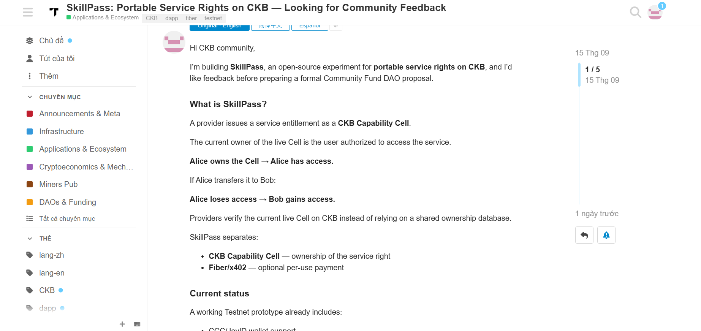
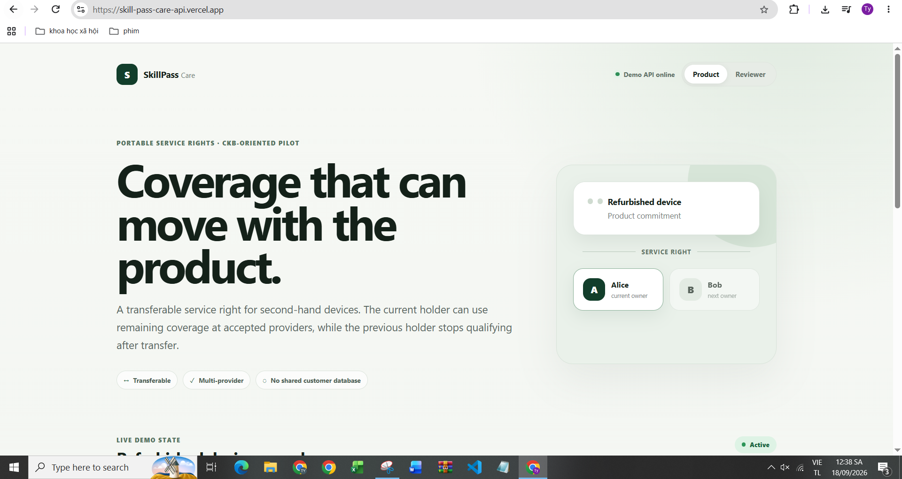

# Week 10 Report — SkillPass: From Portable Service Rights to a Product-Focused Pilot

**Builder:** Dang Ba Ty  
**Track:** Community Keeps Building Builders  
**Project:** SkillPass / SkillPass Care  
**Existing repository:** https://github.com/tydeptrai21042004/ckb-skill/  
**Existing public app:** https://ckb-skill.vercel.app/  
**SkillPass Care deployment:** https://skill-pass-care-api.vercel.app/  
**Week:** 10

---

## 1. Summary

Week 10 focused on two connected goals:

1. **continue hardening the existing SkillPass proposal**, especially the parts needed for independent provider adoption, portable authorization evidence, and safer external integration; and
2. **turn the portable-service-right idea into a more concrete product use case**, which became the new **SkillPass Care** prototype.

The product direction is now easier to explain through a real user problem: when a second-hand product changes owner, remaining service coverage should be able to move with the product instead of remaining trapped in the seller's private customer database.

In the SkillPass Care example, Alice initially owns a refurbished device and its service right. If the product and right are transferred to Bob, Alice should stop qualifying for covered service and Bob should be able to use the remaining coverage at accepted providers.

This preserves the core SkillPass idea from Week 9:

> authorization follows the current holder of a portable right, and independent providers can verify that right without relying on one shared entitlement database.

The important Week 10 change is that this is no longer presented only as an abstract API/service entitlement. It is now being tested as a product-oriented workflow with a clearer end-user story.

---

## 2. Week 9 → Week 10

| Area | Week 9 | Week 10 |
|---|---|---|
| Core framing | Portable service rights on CKB | Same core, now mapped to a concrete product/service-coverage use case |
| Main demo | Service Bundle across Model/Data/Compute APIs | Product coverage that can move from Alice to Bob |
| Provider story | Multiple providers can recognize one entitlement | Independent providers verify current coverage holder under their own policy |
| Existing SkillPass | Demo + live Testnet direction | Hardened provider integration, evidence, adoption and verification surfaces |
| New product work | Not yet separated | **SkillPass Care created as a dedicated product-focused prototype** |
| Deployment focus | Public SkillPass UI | New Vercel-oriented SkillPass Care UI/API deployment and routing work |
| Community work | Asked for direction feedback | Published the portable-right direction publicly, requested technical review, and participated in another CKB protocol review |
| Main next gap | Real Alice → Bob Testnet evidence | Map the Care product model onto a canonical live CKB Cell implementation |

Week 10 therefore did not replace the previous proposal. It used the previous work as the protocol/product foundation and explored whether a narrower application can make the value easier to understand.

---

## 3. Existing SkillPass proposal improved

I continued improving the original SkillPass repository rather than abandoning it after the Week 9 demo.

The current Week 10 snapshot contains a stronger external-provider and verification surface.

### 3.1 Independent provider verification

The provider integration path is now more explicit about what a real provider must independently pin and verify:

- accepted Capability Type Script deployment;
- trusted issuer IDs;
- provider-owned service policy;
- the provider's own CKB RPC / finality policy;
- current live Cell ownership;
- requester ownership of the live Cell lock;
- payment state separately when payment is required.

This matters because the project should not become a centralized entitlement database with CKB added only as metadata. The provider should be able to resolve the authoritative live state from CKB and make its own decision.

The repository also includes a clean-room provider scaffold so an external provider can start from a small integration package rather than copying the entire monorepo.

### 3.2 Portable authorization evidence

The existing SkillPass work was extended with signed authorization evidence and export-oriented verification features.

The current snapshot includes:

- Ed25519-signed authorization evidence;
- stable evidence hashes;
- token-protected evidence retrieval;
- provider acceptance metadata;
- a provider acceptance matrix in the UI;
- post-transfer CKB lifecycle receipt surfaces;
- expiry-soon warnings;
- an offline evidence-verification script.

The intention is not to let old evidence replace a fresh authorization decision. Evidence records the decision that was made, while current access still depends on live state.

### 3.3 Reproducibility and safer release boundaries

The existing repository also contains more explicit release and production-readiness checks, including provider-verifier tests, dependency/version checks, security preflight logic, deployment verification scripts, and funding-candidate verification commands.

For this report I directly ran the focused Week 10 feature-expansion test against the supplied SkillPass snapshot:

```text
4 tests
4 passed
0 failed
```

The test output is included in `evidence/03-skillpass-v1.8-feature-test.txt`.

---

## 4. Community feedback and technical review work

I also spent part of Week 10 asking for external feedback and reviewing related CKB work instead of only iterating privately.

### 4.1 Public request for SkillPass feedback

I published the portable-service-right direction on Nervos Talk and asked the community to review whether the project is sufficiently distinct and useful before moving toward a formal funding proposal.

The post explains the central lifecycle:

```text
Alice owns the service-right Cell
        ↓
Alice is authorized
        ↓
Alice transfers the right to Bob
        ↓
Alice loses access
        ↓
Bob becomes the authorized holder
```

It also explains the separation between entitlement authorization and Fiber/x402-style usage payment.



This is useful because the project needs ecosystem feedback on the actual CKB design, not only a polished UI.

### 4.2 Requested deeper technical feedback

Following Neon's suggestion, I reached out to Hanssen for technical review of the transferable service-right Cell design, multi-provider model, and payment separation. Hanssen confirmed that feedback had been left on GitHub, while noting limited availability because of other protocol work.

This gives me a concrete follow-up path: treat the feedback as protocol input, not just product feedback, and incorporate the parts that affect Cell rules, authorization boundaries, and provider verification.

### 4.3 Contribution to another CKB protocol review

I also volunteered to review Vellum's Claim Cell protocol before its Rust implementation.

The main issue I identified was a possible **non-durable claim removal / replay problem**: if claim creation does not require subject authorization, then a previously removed signed claim could potentially be recreated by a relayer and become active again unless the protocol has a durable anti-replay/tombstone/history rule.

The maintainer acknowledged the issue and asked that it also be recorded on GitHub.

This review work was useful for SkillPass as well because it reinforces an important protocol lesson: a state transition is not secure merely because the current transaction is valid; the design must also define what prevents logically removed state from being recreated later.

---

## 5. New SkillPass Care product

The largest new Week 10 deliverable is **SkillPass Care**.

SkillPass Care takes the portable-right model and applies it to service coverage for products, especially second-hand or refurbished products.

### 5.1 Product problem

Traditional service coverage is often attached to a seller account, customer record, receipt, or provider-specific database.

That creates friction when a product changes owner:

- the new owner may have difficulty proving remaining coverage;
- the original provider may have to manually reconcile ownership;
- independent providers cannot easily verify the same entitlement;
- the previous owner may remain in the database even after the product is sold.

SkillPass Care explores a different model:

> the service right is a portable entitlement whose current holder is the party eligible for covered service.

### 5.2 Core lifecycle

The product demo uses a simple ownership story:

```text
Refurbished device
      +
portable service right
      ↓
Alice = current owner
      ↓
coverage usable at accepted provider(s)
      ↓
transfer product/right to Bob
      ↓
Alice becomes ineligible
Bob becomes current holder
      ↓
Bob can use remaining coverage
```

The current public UI makes that relationship visible directly instead of requiring the reviewer to understand a generic capability model first.



---

## 6. SkillPass Care engineering work

SkillPass Care is not only a visual redesign. The new repository separates the public demo, authenticated pilot API, core transition logic, provider SDK, and future CKB adapter.

### 6.1 Serverless-safe public demo

The public Vercel demo uses a signed browser-session state rather than relying on mutable process memory.

This matters on serverless infrastructure because requests can be handled by different function instances. A demo that stores Alice/Bob state only in one process would behave unpredictably after scaling or cold starts.

The public demo is intentionally non-authoritative and is clearly separated from the future on-chain implementation.

### 6.2 Authenticated pilot API

The repository contains a separate pilot API where issuer, provider, and owner roles are bound to server-side credentials.

Mutating requests use an `expectedVersion` rule so stale clients do not silently overwrite a newer pilot state:

```text
client observed version N
        ↓
mutation requests version N
        ↓
state still N → commit next version
state changed  → reject with conflict
```

This is only a pilot concurrency mechanism. Real CKB atomicity would ultimately come from Cell consumption.

### 6.3 Shared transition rules

Transfer, claim, and status changes are implemented through shared core transition logic so the demo and pilot API do not intentionally maintain two different meanings of the product lifecycle.

This reduces the risk that the polished public demo shows behavior that the actual API does not implement.

### 6.4 Provider-facing package

SkillPass Care contains a dedicated provider SDK/integration layer so a service provider can verify an entitlement through a smaller interface rather than importing the entire application.

This follows the same Week 10 goal as the existing SkillPass provider scaffold: independent adoption should become easier.

### 6.5 Vercel deployment and API routing work

I also worked through the deployment structure for a same-origin Vercel application.

The repository now includes root serverless entrypoints and catch-all API routing so the web UI can call `/api/*` on the same deployment instead of depending on an unreliable local-only topology.

The deployed UI shown in the evidence reports the **Demo API Online** state.

---

## 7. Important honesty boundary: what is production-ready and what is not

A major Week 10 goal was to make the new product look and behave like a serious product without overstating what is already on-chain.

The current SkillPass Care repository deliberately distinguishes:

### Public product/reviewer deployment

- deployed web experience;
- serverless-compatible demo lifecycle;
- same-origin API routing;
- loading/error/reviewer states;
- responsive product UI.

### Authenticated pilot API

- role-bound credentials;
- version-checked mutations;
- core policy enforcement;
- memory-backed pilot implementation for local/single-process use.

### CKB production boundary

The current CKB adapter is **fail-closed** for entitlement reads/writes until the production protocol defines and implements:

- the exact service-right Cell schema;
- canonical live-Cell resolution;
- stable entitlement identity;
- wallet-signed issuance and transfer transactions;
- precise claim consumption/receipt semantics.

Therefore, the Week 10 SkillPass Care deployment should be described as a **production-oriented product prototype and deployment**, not as a completed mainnet or fully on-chain production service.

I consider this explicit boundary important because the demo should help reviewers understand the product without creating false evidence that an off-chain Alice → Bob transition is already a real CKB transfer.

---

## 8. Week 10 evidence checklist

| Evidence | Status |
|---|---|
| Public Nervos Talk direction post | Done |
| Community request for feedback | Done |
| Technical feedback requested from Hanssen | Done |
| Vellum Claim Cell review contribution | Done |
| Existing SkillPass provider-adoption improvements | Done in supplied snapshot |
| Signed authorization evidence surface | Done in supplied snapshot |
| Provider scaffold / independent verification path | Done in supplied snapshot |
| Focused v1.8 feature tests | **4/4 passed** |
| New SkillPass Care repository | Done |
| Product/reviewer UI | Done |
| Public Vercel-oriented deployment | Done |
| Serverless-safe demo state | Done in source |
| Authenticated pilot API | Done in source |
| Shared transition rules | Done in source |
| Provider SDK | Done in source |
| CKB live entitlement adapter | **Not complete; fail-closed by design** |
| Real Care issuance/transfer on CKB Testnet | Next priority |
| Independent real provider using live CKB state | Next priority |

---

## 9. What I learned this week

### Narrower product framing helps

The generic phrase “portable service right” is technically flexible, but the refurbished-device/service-coverage example makes the value easier to understand quickly.

### A production-looking UI is not the same as a production protocol

The SkillPass Care repository now makes that difference explicit. The deployment can be polished while the CKB adapter remains fail-closed until the protocol is defined correctly.

### Independent verification remains the key architectural test

If every provider ultimately has to trust one SkillPass database, the CKB portability claim becomes weak. Provider-owned policy, issuer trust, finality settings, and live Cell resolution therefore remain central.

### Replay and state-history questions matter

The Vellum review reinforced that deletion/removal/transfer semantics need durable protocol rules. Similar questions must be answered for any SkillPass claim or entitlement transition before production deployment.

---

## 10. Next steps

### Priority 1 — Map SkillPass Care onto a real CKB service-right Cell

Define the minimal Cell data and type/lock behavior required for the Care use case instead of immediately supporting every previous SkillPass feature.

The first real flow should be:

1. seller/issuer creates a service-right Cell for one product;
2. Alice is the current owner;
3. Provider A independently verifies Alice from live CKB state;
4. Alice transfers the Cell to Bob;
5. Alice is denied after confirmation;
6. Bob is accepted by Provider A;
7. Provider B independently reaches the same ownership conclusion under its own policy.

### Priority 2 — Capture reproducible Testnet evidence

Publish transaction hashes, outpoints, request/decision receipts, and exact verification steps for the Alice → Bob lifecycle.

### Priority 3 — Keep the Care MVP narrow

For the first real pilot, avoid adding marketplace, DID, reputation, generalized NFT, or complex payment features. The useful question is whether transferable remaining service coverage solves a real provider/second-owner problem.

### Priority 4 — Provider pilot

Find at least one external reviewer/provider willing to run the verifier independently and report integration friction.

### Priority 5 — Continue incorporating protocol feedback

Review Hanssen's feedback carefully and convert it into concrete protocol changes or explicit non-goals before implementing the CKB production adapter.

---

## 11. Questions for community / mentor feedback

1. Is **service coverage that follows product ownership** a stronger and more understandable use case for portable CKB service rights?
2. What is the smallest safe Cell schema for the first real SkillPass Care Testnet pilot?
3. Should claim usage be an on-chain state transition, an off-chain signed provider receipt, or a hybrid for the first version?
4. What should providers independently pin so that the system does not recreate a centralized shared entitlement database?
5. Which parts of the current original SkillPass proposal should be removed from the Care MVP to keep the implementation focused?

---

## 12. Week 10 conclusion

Week 10 was a shift from proving that the SkillPass idea can be demonstrated to asking whether it can become a clearer product.

I continued hardening the original SkillPass proposal around external provider adoption and verifiable authorization evidence, while also creating SkillPass Care as a narrower product-focused implementation.

The current direction can be summarized as:

> **A service right can follow ownership of a product; independent providers can verify the current holder; after transfer, the previous holder should stop qualifying and the new holder should be able to use the remaining service right.**

The next milestone is not another UI expansion. It is a small, reproducible CKB Testnet pilot that proves this exact Care lifecycle using canonical live Cell state and independent provider verification.
